[comment]: <> (Header ends here)

# 3D Slicer

Now the slice views are linked. If you click the **‘Basculez la visibilité dans la vue 3D’** button.
Ainsi toutes les coupes s'afficheront.

## Tutoriel de chargement et de visualisation de données

---
<!-- footer:   "Laboratory for Percutaneous Surgery – Copyright © Queen’s University, 2022"  -->

# Jeu de donées du tutoriel

### Veuillez télécharger les jeux de données suivants:
<https://github.com/PerkLab/PerkLabBootcamp/raw/master/Data/VisualizationTutorial_HeadScene.mrb>

---
# Interface principale
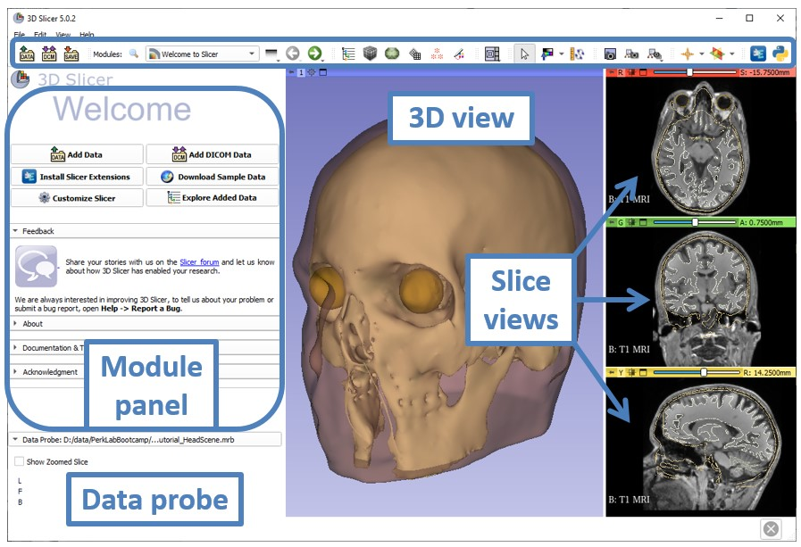

---
# Charger l'échantillon de données IRM
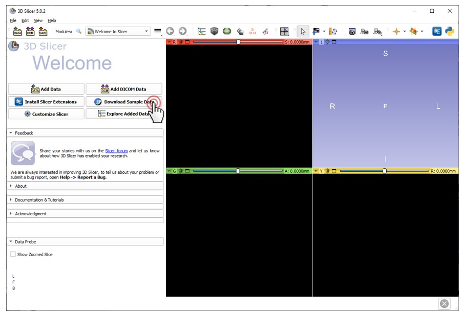

---
# Charger l'échantillon de données IRM
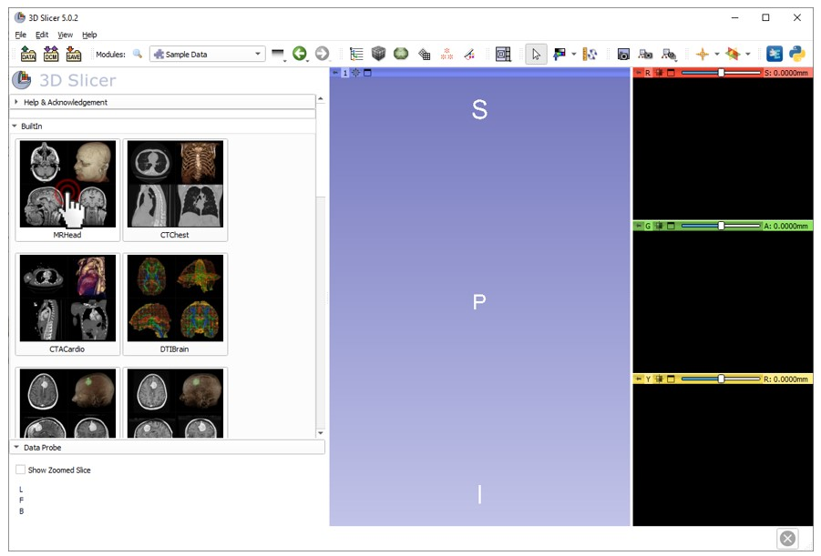

---
<!-- _class: lead -->
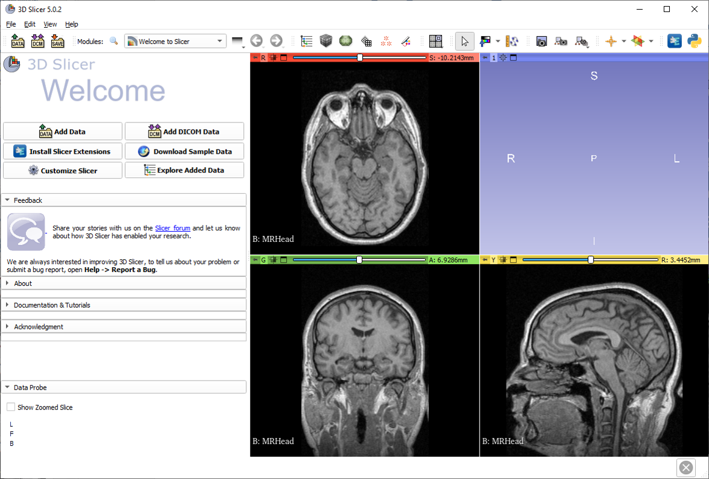
## Charger l'échantillon de données IRM
###### Les vues axiales,sagittales, et coronales affichent automatiquement le volume

---
## Ajuster le paramètre fenêtre/niveau

##### Passer au mode fenêtre/niveau souris

---
## Ajuster le paramètre fenêtre/niveau
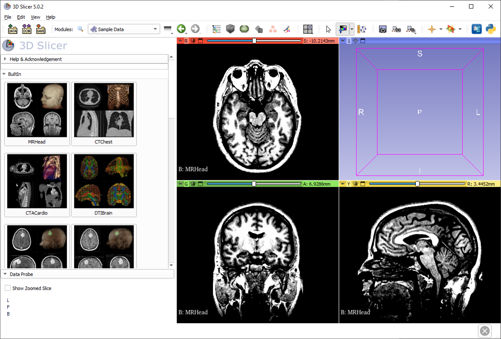
##### Ajuster le paramètre fenêtre/niveau (brightness/contrast) using the left mouse button on a slice view

---
### Retournez au mode vue/transformation
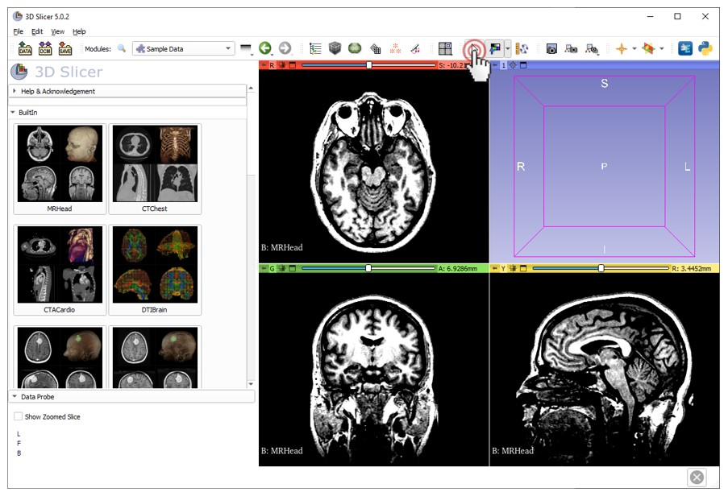

---
# Maximisez ma vue

---
# Options de la vue de la couipe

##### Placez le curseur sur l'icone de la punaise pour afficher la barre d'outils de la vue

---
# Options de la vue de la couipe

##### Une fois la barre d'outils affichée, cliquez sur  “>>”.

---
# Afficher la règle

---
##### Tournez le plan du volume
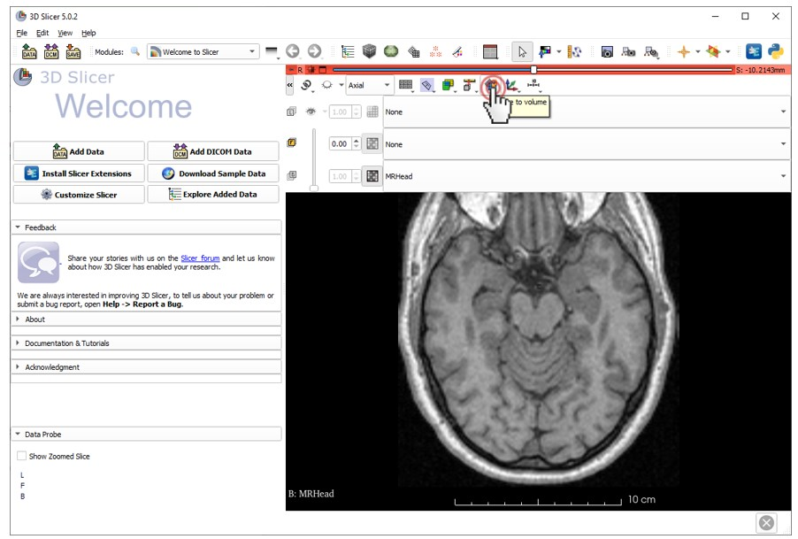
###### Often, MRI volumes are not axis-aligned. To show the true axial view, click the **‘Tournez le plan du volume’** button.
###### Note: Cette image ne sera âs affectée, mais plusieurs images ?R DICOM doivent être alignées.

---
## Retour à la vue conventionnelle
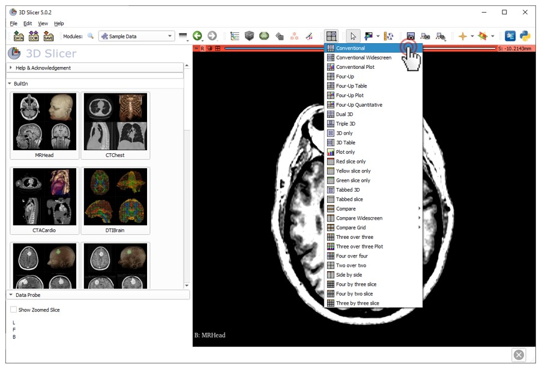

---
# Connecter les vues

After linking views, if any setting is changed in a 2D view, all others follow.

---
### Afficher les vues 3D

Now the slice views are linked. If you click the **‘Basculez la visibilité dans la vue 3D’** button, then all slices will show up.

---
# Afficher les vues 3D

All three anatomical slices are shown in the 3D view.

---
# Naviguer entre les vues 3D
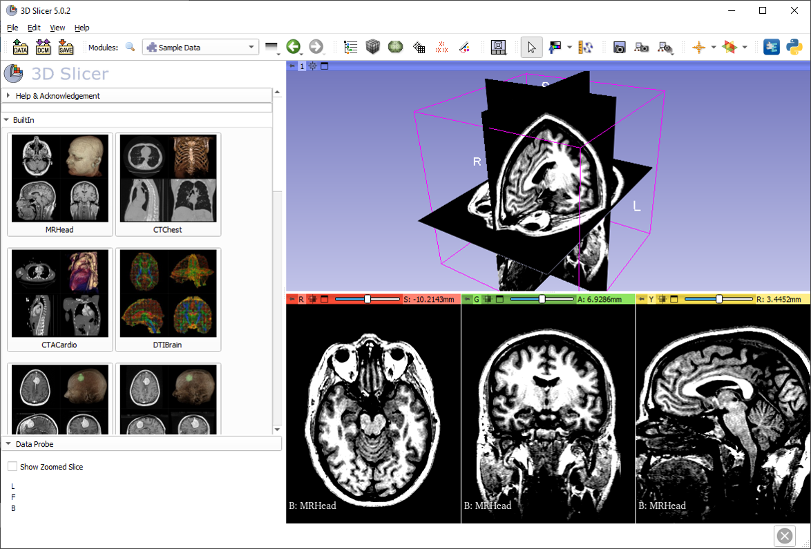
Use the left mouse button to **rotate**, and the right mouse button to **zoom** in and out.

---
# Fermer la scène

---
### Partie 2: Visualisation 3D des modèles de surface du cerveau

---
#### Charger la scène du tutoriel
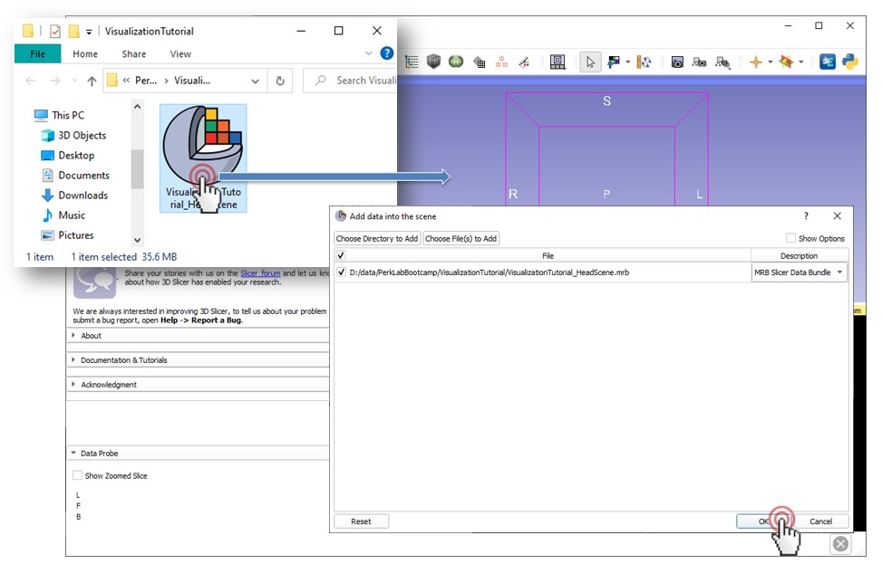
Drag and drop the file VisualizationTutorial_HeadScene.mrb into Slicer, then click **OK**.

---
# Centrer la vue
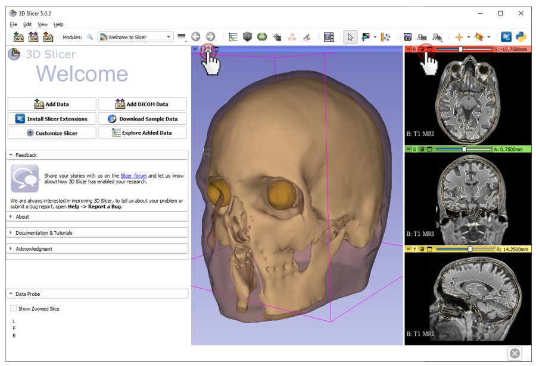
Click on the small box icon to center the view, in 3D or in 2D

---
## Explorer les données chargées

You can use the module list, or the favorite module toolbar to switch to the **Data module**

---
#### Explorer les données chargées

###### Le module Data affiche toutes les données de la scène.
###### Les noeuds peuvent être affichés ou cachés, renommés, supprimés, clonés, etc.
###### Cachez le modèle  **‘peau’** en cliquant sur l'icone de l'oeil.
